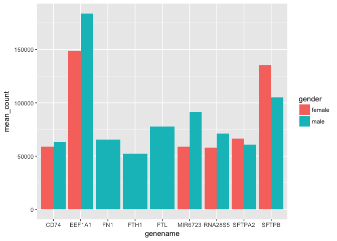

Analysis Report 2: Gender-based Prognostic Analysis of Known Gene Drivers in Patients with Lung adenocarcinoma
================
Alfredo Hans Locht
November 10, 2017

*Overall, a single-spaced page is about 500 words. So if the guidelines say half of a page, think about writing around 250 words. You can use the wordcountaddin in RStudio to track your progress.*

Introduction
============

Background
----------

Lung cancer has been identified worldwide as the most prevalent type of cancer with the highest mortality rates in developed countries (Sakurai *et al.*, 2010; Li *et al.*, 2015; Seo *et al.*, 2012). Tobacco cigarette smoking has been identified as the main contributer, along with a host of other genetic and environmental factors, to cause Lung adenocarcinoma, the most common type of non-small cell lung cancer (NSCLC). Genetic research in this field has mainly focused on finding the gene-expression differences between non-smokers and smokers with NSCLC and even between smokers who have and have not contracted any form of NSCLC (Cheng *et al.*, 2012; Li *et al.*, 2015; Seo *et al.*, 2012). These studies have found significant gene expression profile differences between smokers and nonsmokers with NSCLC; however, these studies have not addressed gender-based expression differences.

Although there has been an over 500% increase in lung cancer rates among women since the 1980's, it is becoming increasingly evident that women contain gender-based genetic differences that predicate a favorable prognosis and higher survival rate than men when normalizing for other factors (Is there a gender difference in non-small cell lung cancer survival?, 2004; Sakurai *et al.*, 2010). These gender-based differences have only been observed on clinicopathological basis with not much emphasis on the genetic data that may be available for such an analysis. Although common grounds have not been genetically established for a gender-based analysis of NSCLC, the disease has been able to be characterized genetically, by mutational analysis.

Given how 60 of the known carcinogens in tobacco smoke can actively mutate cells to become cancerous, there have been several somatic point mutations as well as aberrant fusion gene products identified specifically in NSCLC (Al-Saad *et al.*, 2017; Cheng *et al.*, 2012; Seo *et al.*, 2012; Collisson *et al.*, 2014). These genes can serve as a basis for a potential gender-based NSCLC analysis because they are not gender-discriminate, and because the resulting biology from their mutations is relatively well understood.

Objective
---------

In this study, to emphasize that there are key distinctions between male and female gene expression profiles, genes that have been identified through somatic point mutations and contributing to malignency in NSCLC will be analyzed per the Li et al dataset and metadata (Al-Saad *et al.*, 2017; Li *et al.*, 2015). Specifically, the genes that will be analyzed are Epithelial growth factor receptor (EFGR), Kirsten rat sarcoma virus (KRAS), mesenchymal-epithelial transition factor (MET) as well as insulin-like growth factor 1 receptor (IGFR1), all of which are potential therapeutic targets against advancing malignancy. It is also important to note that EFGR1, IGFR1 and MET (more commonly known as c-Met or HGFR) not only play critical roles in activating pathways such as RAS-MAPK pathway, but are also characterized as important in patient-developed treatment resistance (Al-Saad *et al.*, 2017). Furthermore, Al-Saad et al. describes that high expression of MET and EFGR1 (either through high gene copy or abberant transcription amplification) are indicative biomarkers of a negative prognosis in NSCLC (Al-Saad *et al.*, 2017). The expression of these genes will be divided by gender, age at diagnosis, and cancer stage to elucidate how women have gene expression differences that contribute to a better prognosis in NSCLC.

Methods
=======

Sample origin and sequencing
----------------------------

The dataset generated by Seo et al. for their journal article, The transcriptional landscape and mutational profile of lung adenocarcinoma, was obtained by collecting 200 specimens from 87 patients inflicted with lung adenocarcinoma who had undergone major lung resection surgeries at Saint Mary's Hospital in Seoul, South Korea. The patients provided their smoking history which included smokers (47), non-smokers (36), and some who did not not disclose their smoking history (4). All of the samples originated from people of Korean ethnicity, and out of the 200 specimen, 87 were identified as cancerous stemming from driver mutations while 77 samples were identified to be normal tissue as a basis for comparison of gene expression profiles against the cancerous samples. Together, these 164 were RNA-sequenced using an Illumina HiSeq 2000 sequencer yielding ~ 14 billion paired-end, 101-bp long reads (Seo *et al.*, 2012). Additionally, genomic DNA was extracted from normal lung tissue for exome sequencing. Together, the RNA and exome sequencing reads were aligned to the NCBI human reference genome (build 37.1) using GSNAP with a 5% allowance for mismatches. Image analysis and basecalling was performed using the Illumina pipeline on the default settings (v1.8).

Li et al. obtained 68 lung adenocarcinoma patient transcriptome sequencing data from the aforementioned Seo et al. study database. Each patient had their tumor and normal tissue sequenced comparitively, and the total amount and length of paired-end sequences mimicked the Seo et al. study because it was the same data. However, they normalized the data to be an equal amount of non-smokers (34) vs smokers (34) by exluding the data of patients over the age of 75 to ensure equal comparing grounds (Li *et al.*, 2015).

Computational
-------------

These are the methods that were used to process the sequencing data. Should probably be at least a half of a page. At a very minimum should include citations for biomartr, trimmomatic, and sailfish. Note that these three methods references don't count towards the five references you need to cite in the introduction.

Results
=======

Data was subsetted from Li et al. to create all the figures in the Results section. Importantly to note is that each gene that was analyzed (EGFR, KRAS, MET and IGF1R) has exactly the same number of samples (76) that were divided into 31 females and 45 males across all genes. This indicates that the results are comparable because essentially the same sub-sample set was used for each figure created. The data that was subsetted for the genes of interest however, failed to include any females in stage 2B, so there is no representation of females for that cancer stage for any gene of interest.

| gender | genename |  mean\_count|
|:-------|:---------|------------:|
| male   | EEF1A1   |    183911.87|
| female | EEF1A1   |    149021.94|
| female | SFTPB    |    135305.42|
| male   | SFTPB    |    105009.56|
| male   | MIR6723  |     91501.45|
| male   | FTL      |     77787.92|
| male   | RNA28S5  |     71265.16|
| female | SFTPA2   |     66520.77|
| male   | FN1      |     65454.33|
| male   | CD74     |     63047.61|
| male   | SFTPA2   |     60627.62|
| female | CD74     |     58994.05|
| female | MIR6723  |     58916.57|
| female | RNA28S5  |     58079.55|
| male   | FTH1     |     52390.78|

**Table 1**: The most highly expressed genes in both genders included *SFTPB* and *EEF1A1*.



**Figure 1 Description**: Figure 1 shows the top 15 most highly expressed genes per gender.

``` r
# efgr expression at different cancer stages
# Seo et al. discusses that 79% of
# their patients' nsclc is driven
# by point mutations in efgr.
egfr <- final_table %>%
  filter(genename == "EGFR") %>%
  group_by(gender, age_at_diagnosis, cancer_stage) %>%
  summarize(mean_count = mean(counts_lengthscaledtpm)) %>%
  arrange(desc(mean_count))

egfr %>%
  ggplot(aes(x = cancer_stage,
             y = mean_count,
             fill = gender)) +
    geom_col(position = "dodge", aes(color = age_at_diagnosis))
```


**Figure 2 Description**: Figure 2 shows EFGR expression according to gender through different cancer stages. EFGR expression is overall higher in males of any age at any cancer stage. The borders dividing the columns horizontally represent each gender at a specific cancer stage by age range, so it is evident that EFGR expression does not follow an age-trend in males as the high expression in stage 3A shows most of the males to be in their 80s while the high expression in stage 3B indicates that the population of males with high EFGR expression is closer to their 40s. Female expression of EFGR across all cancer stages is mostly inclusive to older women in their 70s and 80s.

``` r
# kras expression at different cancer stages
# Kras is activated through the RAS-MAPK 
# signaling pathway responsible for
# cell proliferation.
kras <- final_table %>%
  filter(genename == "KRAS") %>%
  group_by(gender, age_at_diagnosis, cancer_stage) %>%
  summarize(mean_count = mean(counts_lengthscaledtpm)) %>%
  arrange(desc(mean_count))

kras %>%
  ggplot(aes(x = cancer_stage,
             y = mean_count,
             fill = gender)) +
    geom_col(position = "dodge", aes(color = age_at_diagnosis))
```


**Figure 3 Description**: Figure 3 shows KRAS expression according to gender through different cancer stages. KRAS expression across cancer stages is much higher than EFGR for both sexes. In general, both sexes have a much higher expression of KRAS in stages 1A-2B than they do in stages 3A-4 (not including NA cancer stage). There is also more vairance in the age ranges as it appears that all the age ranges experience KRAS expression in stages 1A and 1B. Females; however, show less expression of KRAS overall.

``` r
# met expression at different cancer stages:
# met is implicated by [@Al-Saad2017]
# to be responsible for oncogenic potential
# when overexpressed.
met <- final_table %>%
  filter(genename == "MET") %>%
group_by(gender, age_at_diagnosis, cancer_stage) %>%
  summarize(mean_count =
              mean(counts_lengthscaledtpm)) %>%
  arrange(desc(mean_count))

met %>%
  ggplot(aes(x = cancer_stage,
             y = mean_count,
             fill = gender)) +
  geom_col(position = "dodge",
           aes(color = age_at_diagnosis))
```


**Figure 4 Description**: MET expression is shown in figure 4, and it can be seen that stage 1A for males and stage 1B for females resembles the KRAS expression in Figure 3 in terms of proportionality to other cancer stages and age division reprentation. Overall, MET expression is very high in both sexes by a power of ten than the Kras expressions. It is also higher in males in the later stages of cancer (except for 1A), but there is no trend in age factors. Conversely, MET expression is lower in females in later stages of cancer, but there is no age trend either. Female expression of MET is significantly lower overall whenc compared to male expression of MET across all cancer stages.

``` r
# ig1fr expression at differen cancer stages:
# [@Al-Saad2017] has found that it igf1r is
# a negative prognostic indicator
# specifically for males.
igf1r <- final_table %>%
  filter(genename == "IGF1R") %>%
  group_by(gender,
           age_at_diagnosis,
           cancer_stage) %>%
  summarize(mean_count =
              mean(counts_lengthscaledtpm)) %>%
  arrange(desc(mean_count))

igf1r %>%
  ggplot(aes(x = cancer_stage,
             y = mean_count,
             fill = gender)) +
  geom_col(position = "dodge",
           aes(color = age_at_diagnosis))
```


**Figure 5 Description**: Expression of IGF1R gives a much more detailed look at expression in females vs males than the rest of the genes because expression is much higher overall. Importantly, we see that male expression of IGF1R is much higher than any particular female expression at a specific stage. For males, the columns are more segmented across the stages which indicates that all age ranges are represented in male IGF1R expression. In comparison, females are predominantly more dominated by older age ranges in almost every cancer stage.

Discussion
==========

Gender-based differences in gene expression profiles per cancer stage are clearly visible in the genes which have been characterized by both (Seo *et al.*, 2012) and (Al-Saad *et al.*, 2017) as having a high impact on the prognosis of lung adenocarcinoma. Seo et al. specifically mentions that point mutations in EGFR and KRAS are considered gene drivers which, when expressed in cancer cells, consequently experience higher levels of expression than in normal cells.

Although the possible mutational effects of this transcriptome data cannot be directly inferred, the raw expression reads for EFGR and KRAS in figures 2 and 3 respectively do not show increased levels of EGFR and KRAS expression in comparison to the other genes of interest. It is interesting however, that the levels of expression in EFGR do not directly correlate to expression levels of KRAS. According to (Al-Saad *et al.*, 2017), EFGR can be directly responsible for activating the RAS-MAPK signaling pathway when activated, so it was expected that expression levels of EFGR would be similar to KRAS since these two entities are thought to directly interact with each other in normal cells.

Instead, there is a more similar pattern of expression between KRAS and MET genes. MET has incredibly high gene expression as shown in figure 4 where the total number of reads for males in stage 1A being greater than 50,0000. Similarly KRAS expression in males for stage 1A cancer reaches almost 6000 reads. It has been related by (Al-Saad *et al.*, 2017) that activation of MET, which can actually result from anti-EFGR treatment, can cause downstream activation of RAS-MAPK as well, which leads to treatment resistance in some patients. Although we lack any metadata indicating what kind of treatment these patients were receiving if any, it seems that MET overexpression has directly influenced KRAS expression in males in stages 1A, 2B, and 3A and also in females in stages 1B, 3A and 3B. KRAS, being a well-characterized biomarker of cancer, however, is still significantly more expressed in males than in females at most stages of cancer.

Finally, IGFR expression seems to be relatively more well distributed across cancer stages than any of the other genes. However, we can see that it is also more greatly expressed in males than in females. Overt IFGR expression was directly correlated to a negative prognostic indicator in males, but not in females (Al-Saad *et al.*, 2017). Hormone effects on various genes are primarily thought to be responsible for these differences, so there is increasing research in anti-IFGR treatment with biologics. There are already promising preclinical trials of anti-IFGR treatment in breast cancer patients; however, this data would suggest that males would benefit to a greater extent.

In compiling the figures, the omission of females in stage 2B because of lack of transcripts in the genes of interest could lead to a potential bias. Furthermore, the data is skewed towards males because there were more males in the subsetted data sets than females (45 vs. 31).

For future studies, the need for more detailed metadata including length and intensity of smoking habits as well as any previously indicated treatments that have been applied to the tissue would be useful for discerning further trends in expression, especially in the gene drivers responsible for NSCLC.

Sources Cited
=============

Al-Saad,S. *et al.* (2017) The impact of MET, IGF-1, IGF1R expression and EGFR mutations on survival of patients with non-small-cell lung cancer. *PLoS ONE*, **12**, 1–21.

Cheng,P. *et al.* (2012) Comparison of the gene expression profiles between smokers with and without lung cancer using RNA-Seq. *Asian Pacific journal of cancer prevention : APJCP*, **13**, 3605–9.

Collisson,E. *et al.* (2014) Comprehensive molecular profiling of lung adenocarcinoma. *Nature*, **511**, 543–550.

Is there a gender difference in non-small cell lung cancer survival? (2004) *Gender Medicine*, **1**, 41–47.

Li,Y. *et al.* (2015) RNA-seq analysis of lung adenocarcinomas reveals different gene expression profiles between smoking and nonsmoking patients. *Tumor Biology*, **36**, 8993–9003.

Sakurai,H. *et al.* (2010) Survival Differences by Gender for Resected Non-small Cell Lung Cancer: A Retrospective Analysis of 12,509 Cases in a Japanese Lung Cancer Registry Study. *Journal of Thoracic Oncology*, **5**, 1594–1601.

Seo,J.-S. *et al.* (2012) The transcriptional landscape and mutational profile of lung adenocarcinoma. *Genome research*, **22**, 2109–2119.
